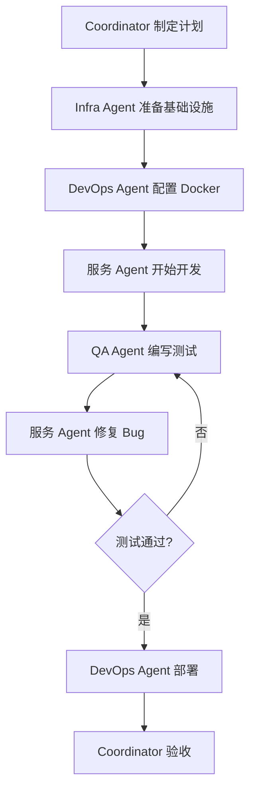
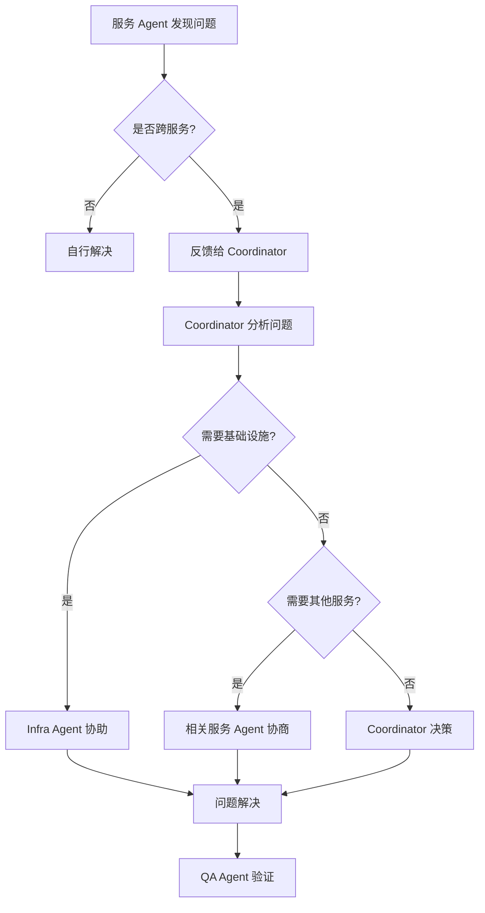

# FundProphet 微服务架构 - 多 Agent 协作方案

## 一、Agent 角色体系

### 1.1 Agent 层级架构

```
┌─────────────────────────────────────────────────────────────┐
│                    主协调 Agent (Coordinator)                │
│                    整体架构决策、任务分发、进度跟踪            │
└────────────────────────────┬────────────────────────────────┘
                             │
        ┌────────────────────┼────────────────────┐
        │                    │                    │
   ┌────▼────┐          ┌────▼────┐          ┌────▼────┐
   │Infra   │          │  QA     │          │  DevOps │
   │Agent   │          │Agent    │          │Agent   │
   │基础设施│          │质量保障  │          │运维部署  │
   └─────────┘          └─────────┘          └─────────┘
                             │
    ┌────────────────────────┼────────────────────────┐
    │                        │                        │
┌───▼───┐  ┌───▼───┐  ┌───▼───┐  ┌───▼───┐  ┌───▼───┐  ┌───▼───┐
│Fund   │  │Stock  │  │News   │  │Market │  │Fund-  │  │LLM    │
│Svc    │  │Svc    │  │Svc    │  │Svc    │  │Intel  │  │Svc    │
│Agent  │  │Agent  │  │Agent  │  │Agent  │  │Agent  │  │Agent  │
└───────┘  └───────┘  └───────┘  └───────┘  └───────┘  └───────┘
```

### 1.2 Agent 详细职责

| Agent | 名称 | 核心职责 | 交付物 |
|-------|------|----------|--------|
| **Coordinator** | 主协调 Agent | 整体架构设计、任务分发、进度跟踪、模块对接、最终验收 | 架构文档、API 规范、集成报告 |
| **Infra Agent** | 基础设施 Agent | Redis、Traefik、MySQL 连接池改造、缓存改造 | 基础设施配置、连接池代码、缓存适配层 |
| **DevOps Agent** | 运维部署 Agent | Docker Compose、CI/CD、监控告警、日志收集 | docker-compose.yml、部署脚本、监控配置 |
| **QA Agent** | 质量保障 Agent | 测试策略、测试用例编写、集成测试、E2E 测试 | 测试报告、测试用例库 |
| **Fund Svc Agent** | 基金服务 Agent | 基金数据爬取、LSTM 预测、指标计算、API 开发 | services/fund/ 目录 |
| **Stock Svc Agent** | 股票服务 Agent | 股票数据、LSTM 训练、技术指标、API 开发 | services/stock/ 目录 |
| **News Svc Agent** | 新闻服务 Agent | 新闻爬取、存储、API 开发 | services/news/ 目录 |
| **Market Svc Agent** | 市场服务 Agent | 宏观数据、资金流向、情绪分析、API 开发 | services/market/ 目录 |
| **Fund-Intel Agent** | 基金智能服务 Agent | 行业分析、新闻分类、基金-新闻关联、投资建议 | services/fund-intel/ 目录 |
| **LLM Svc Agent** | 大模型服务 Agent | DeepSeek/MiniMax 客户端、LLM API、缓存优化 | services/llm/ 目录 |

---

## 二、组织架构与协作模式

### 2.1 三层协作架构

```
┌─────────────────────────────────────────────────────────────┐
│                   第1层：协调层 (Coordination)                │
│  Coordinator Agent                                           │
│  - 制定整体计划                                               │
│  - 定义 API 契约                                              │
│  - 任务分发与跟踪                                             │
│  - 冲突解决                                                   │
└────────────────────────────┬────────────────────────────────┘
                             │
┌────────────────────────────▼────────────────────────────────┐
│                   第2层：支撑层 (Support)                     │
│  Infra Agent  +  QA Agent  +  DevOps Agent                   │
│  - 基础设施搭建                                               │
│  - 质量保障                                                   │
│  - 部署运维                                                   │
└────────────────────────────┬────────────────────────────────┘
                             │
┌────────────────────────────▼────────────────────────────────┐
│                   第3层：业务层 (Business Services)           │
│  Fund Svc  +  Stock Svc  +  News Svc  +  Market Svc          │
│  +  Fund-Intel Svc  +  LLM Svc                               │
│  - 独立服务开发                                               │
│  - 单元测试                                                   │
│  - API 对接                                                   │
└─────────────────────────────────────────────────────────────┘
```

### 2.2 Agent 沟通矩阵

| 发起方 | 接收方 | 沟通内容 | 频率 |
|--------|--------|----------|------|
| Coordinator | 所有 Agent | 任务下发、进度询问 | 每日 |
| 所有 Agent | Coordinator | 任务汇报、问题反馈 | 实时 |
| Infra Agent | 所有服务 Agent | 基础设施就绪通知 | 一次性 |
| 所有服务 Agent | Infra Agent | 基础设施使用咨询 | 按需 |
| QA Agent | 所有服务 Agent | 测试标准、测试用例 | 每周 |
| 所有服务 Agent | QA Agent | 提交测试请求 | 按需 |
| 服务 Agent 之间 | 服务 Agent  | API 对接、跨服务调用 | 按需 |
| DevOps Agent | 所有 Agent | 部署环境配置 | 一次性 |
| 所有 Agent | DevOps Agent | 部署请求 | 按需 |

---

## 三、分工合作机制

### 3.1 三阶段开发流程

```
阶段1：基础设施 (1-2周)
┌─────────────────────────────────────────────────────────────┐
│ Coordinator: 制定微服务拆分方案                               │
│      ↓                                                        │
│ Infra Agent: Redis + Traefik + MySQL连接池改造               │
│      ↓                                                        │
│ DevOps Agent: Docker Compose 配置                            │
│      ↓                                                        │
│ QA Agent: 定义测试框架                                        │
└─────────────────────────────────────────────────────────────┘

阶段2：服务拆分 (3-10周)
┌─────────────────────────────────────────────────────────────┐
│ Coordinator: 按优先级分发任务                                │
│      ↓                                                        │
│ Phase 2.1: LLM Service (3-4周)                               │
│   LLM Svc Agent 独立开发 → QA 验收                           │
│      ↓                                                        │
│ Phase 2.2: News + Market Service (5-6周)                     │
│   News Svc Agent + Market Svc Agent 并行开发                  │
│      ↓                                                        │
│ Phase 2.3: Fund-Intel Service (7-8周)                        │
│   Fund-Intel Agent 跨服务对接 → QA 验收                      │
│      ↓                                                        │
│ Phase 2.4: Stock + Fund Service (9-12周)                     │
│   Stock Svc Agent + Fund Svc Agent 并行开发                   │
└─────────────────────────────────────────────────────────────┘

阶段3：集成部署 (13-14周)
┌─────────────────────────────────────────────────────────────┐
│ DevOps Agent: 生产环境部署                                    │
│      ↓                                                        │
│ QA Agent: 集成测试 + E2E 测试                                 │
│      ↓                                                        │
│ Coordinator: 最终验收 + 文档整理                              │
└─────────────────────────────────────────────────────────────┘
```

### 3.2 任务分配策略

#### 优先级矩阵

| 优先级 | 任务类型 | Agent | 时间窗口 | 风险等级 |
|--------|----------|-------|----------|----------|
| **P0** | 基础设施改造 | Infra + DevOps | 第1-2周 | 低 |
| **P0** | LLM Service 拆分 | LLM Svc Agent | 第3-4周 | 中 |
| **P1** | News + Market Service | News + Market Agents | 第5-6周 | 低 |
| **P1** | Fund-Intel Service | Fund-Intel Agent | 第7-8周 | 中高 |
| **P2** | Stock + Fund Service | Stock + Fund Agents | 第9-12周 | 高 |

#### 依赖关系图

```
Infra Agent (Redis/MySQL连接池)
    │
    ├─→ LLM Svc Agent (无依赖，最简单)
    │       │
    │       └─→ News Svc Agent (调用 LLM)
    │       └─→ Fund-Intel Agent (调用 LLM)
    │
    ├─→ News Svc Agent
    │       │
    │       └─→ Fund-Intel Agent (调用 News API)
    │
    ├─→ Market Svc Agent (无依赖，独立)
    │
    ├─→ Fund Svc Agent (依赖 Infra)
    │
    └─→ Stock Svc Agent (依赖 Infra)
```

---

## 四、具体任务分解

### 4.1 Coordinator Agent (主协调 Agent)

**职责清单**:
- [ ] 制定微服务拆分方案
- [ ] 定义跨服务 API 契约
- [ ] 分发任务到各 Agent
- [ ] 每日进度跟踪
- [ ] 解决 Agent 间冲突
- [ ] 最终集成测试
- [ ] 文档整理

**关键决策**:
1. 服务边界划分
2. API 接口规范
3. 数据共享策略
4. 优先级排序
5. 验收标准制定

---

### 4.2 Infra Agent (基础设施 Agent)

**任务清单**:
```yaml
阶段1：连接池改造
  - 任务1: data/mysql.py 改为 SQLAlchemy 连接池
    文件: shared/db.py
    接口: get_connection() 保持不变
    测试: tests/test_infra/test_db_pool.py

  - 任务2: data/cache.py 改为 Redis 客户端
    文件: shared/cache.py
    接口: cache.get/set/clear 保持不变
    测试: tests/test_infra/test_redis_cache.py

  - 任务3: 从 server/app.py 提取定时任务
    文件: scheduler/app.py
    独立进程，不随 API 扩容
    测试: tests/test_infra/test_scheduler.py

阶段2：API 网关
  - 任务4: 配置 Traefik
    文件: traefik/traefik.yml
    路由规则: /api/stock/*, /api/fund/* 等
    测试: curl 验证路由

阶段3：Redis 消息队列
  - 任务5: 配置 Redis Streams
    文件: shared/messaging.py
    消息流: news:crawled, fund:sync, lstm:train
    测试: tests/test_infra/test_messaging.py
```

**验收标准**:
- [ ] 连接池测试通过（并发100请求）
- [ ] 缓存性能测试通过（QPS > 10000）
- [ ] Redis 消息队列正常收发
- [ ] Traefik 路由规则生效

---

### 4.3 DevOps Agent (运维部署 Agent)

**任务清单**:
```yaml
阶段1：本地开发环境
  - 任务1: Docker Compose 配置
    文件: docker-compose.yml
    服务: redis, mysql, traefik, 6个微服务
    测试: docker-compose up -d

  - 任务2: 环境变量管理
    文件: .env.example
    变量: DB_HOST, REDIS_URL, DEEPSEEK_API_KEY
    测试: 修改环境变量重启服务

阶段2：CI/CD
  - 任务3: GitHub Actions 配置
    文件: .github/workflows/ci.yml
    流程: lint → test → build → deploy
    测试: push 触发流程

阶段3：监控告警
  - 任务4: 日志收集
    文件: logging/promtail.yml
    工具: Loki + Grafana
    测试: 查看日志聚合

  - 任务5: 健康检查
    文件: docker-compose.yml (healthcheck)
    端点: /health, /metrics
    测试: docker ps 检查状态
```

**验收标准**:
- [ ] 所有服务通过 docker-compose 启动
- [ ] CI/CD 流程自动化
- [ ] 日志可查询聚合
- [ ] 健康检查自动重启

---

### 4.4 QA Agent (质量保障 Agent)

**任务清单**:
```yaml
阶段1：测试框架搭建
  - 任务1: pytest 配置
    文件: tests/conftest.py
    Fixtures: db_connection, redis_client, http_client
    测试: pytest --fixtures

  - 任务2: 测试数据管理
    文件: tests/fixtures/
    数据: sample_fund.json, sample_news.json
    测试: 加载测试数据

阶段2：单元测试规范
  - 任务3: 编写测试模板
    文件: tests/unit/test_template.py
    覆盖率: > 80%
    测试: pytest --cov

阶段3：集成测试
  - 任务4: 服务间调用测试
    文件: tests/integration/test_service_communication.py
    场景: Fund-Intel 调用 LLM/News/Fund
    测试: pytest tests/integration/

阶段4：E2E 测试
  - 任务5: 完整流程测试
    文件: tests/e2e/test_full_workflow.py
    场景: 新闻爬取 → 分类 → 基金匹配 → 投资建议
    测试: pytest tests/e2e/

阶段5：性能测试
  - 任务6: 负载测试
    工具: locust
    场景: 并发100用户访问
    测试: locust -f tests/performance/locustfile.py
```

**验收标准**:
- [ ] 单元测试覆盖率 > 80%
- [ ] 集成测试通过
- [ ] E2E 测试通过
- [ ] 性能测试达标

---

### 4.5 Fund Svc Agent (基金服务 Agent)

**任务清单**:
```yaml
服务创建:
  - 任务1: 创建 Flask 应用骨架
    文件: services/fund/app.py
    路由: /api/fund/*
    端口: 8002

  - 任务2: 迁移数据层
    源: data/fund_repo.py, data/fund_fetcher.py
    目标: services/fund/data/
    测试: 单元测试迁移

功能开发:
  - 任务3: 基金列表 API
    端点: GET /api/fund/list
    缓存: 30分钟
    测试: tests/services/fund/test_list.py

  - 任务4: 基金详情 API
    端点: GET /api/fund/:code
    缓存: 1小时
    测试: tests/services/fund/test_detail.py

  - 任务5: LSTM 预测 API
    端点: GET /api/fund/:code/predict
    调用: services/fund/analysis/fund_lstm.py
    测试: tests/services/fund/test_predict.py

定时任务:
  - 任务6: 基金净值同步
    时间: 每天 03:00
    调用: Redis Stream fund:sync
    测试: 手动触发验证
```

**交付物**:
- services/fund/ 目录完整
- 单元测试通过
- API 文档

---

### 4.6 Stock Svc Agent (股票服务 Agent)

**任务清单**:
```yaml
服务创建:
  - 任务1: 创建 Flask 应用
    文件: services/stock/app.py
    路由: /api/stock/*, /api/lstm/*
    端口: 8001

  - 任务2: 迁移 LSTM 模块
    源: analysis/lstm_*.py
    目标: services/stock/analysis/
    测试: 模型训练测试

功能开发:
  - 任务3: LSTM 训练 API
    端点: POST /api/lstm/train
    分布式锁: Redis SETNX
    测试: tests/services/stock/test_train.py

  - 任务4: LSTM 预测 API
    端点: GET /api/lstm/predict?symbol=
    缓存: 5分钟
    测试: tests/services/stock/test_predict.py

  - 任务5: 技术指标计算
    端点: GET /api/stock/indicators?symbol=
    指标: MA, MACD, RSI, 布林带
    测试: tests/services/stock/test_indicators.py

定时任务:
  - 任务6: LSTM 自动训练
    时间: 每天 04:00
    调用: Redis Stream lstm:train
    测试: 训练日志验证
```

**交付物**:
- services/stock/ 目录完整
- LSTM 模型训练通过
- 单元测试通过

---

### 4.7 News Svc Agent (新闻服务 Agent)

**任务清单**:
```yaml
服务创建:
  - 任务1: 创建 Flask 应用
    文件: services/news/app.py
    路由: /api/news/*
    端口: 8003

  - 任务2: 迁移新闻模块
    源: data/news/crawler.py, data/news/repo.py
    目标: services/news/data/
    测试: 爬虫测试

功能开发:
  - 任务3: 新闻列表 API
    端点: GET /api/news/list
    参数: days, category
    缓存: 5分钟
    测试: tests/services/news/test_list.py

  - 任务4: 新闻同步 API
    端点: POST /api/news/sync
    去重: URL 唯一键
    事件: 发布 news:crawled 到 Redis
    测试: tests/services/news/test_sync.py

  - 任务5: 增量爬取
    策略: 只爬当天新闻
    频率控制: 4小时一次，每日最多4次
    测试: 频率限制测试
```

**交付物**:
- services/news/ 目录完整
- 爬虫正常工作
- 事件发布验证

---

### 4.8 Market Svc Agent (市场服务 Agent)

**任务清单**:
```yaml
服务创建:
  - 任务1: 创建 Flask 应用
    文件: services/market/app.py
    路由: /api/market/*
    端口: 8004

  - 任务2: 迁移市场模块
    源: data/market/crawler.py, data/market/repo.py
    目标: services/market/data/
    测试: 数据爬取测试

功能开发:
  - 任务3: 宏观数据 API
    端点: GET /api/market/macro
    数据: GDP, CPI, PMI, M2
    缓存: 1天
    测试: tests/services/market/test_macro.py

  - 任务4: 资金流向 API
    端点: GET /api/market/money-flow
    数据: 北向资金、主力资金
    缓存: 1小时
    测试: tests/services/market/test_money_flow.py

  - 任务5: 市场情绪 API
    端点: GET /api/market/sentiment
    数据: 涨跌停、成交额
    缓存: 1小时
    测试: tests/services/market/test_sentiment.py
```

**交付物**:
- services/market/ 目录完整
- 所有 API 正常
- 零跨服务依赖

---

### 4.9 Fund-Intel Agent (基金智能服务 Agent)

**任务清单**:
```yaml
服务创建:
  - 任务1: 创建 Flask 应用
    文件: services/fund-intel/app.py
    路由: /api/fund-industry/*, /api/investment-advice/*
    端口: 8005

  - 任务2: 迁移业务模块
    源: modules/fund_industry/, modules/news_classification/
    目标: services/fund-intel/modules/
    测试: 模块单元测试

跨服务对接:
  - 任务3: 调用 Fund Service
    文件: services/fund-intel/clients/fund_client.py
    接口: GET http://fund-service:8002/api/fund/:code
    缓存: 1小时
    测试: tests/services/fund-intel/test_fund_client.py

  - 任务4: 调用 News Service
    文件: services/fund-intel/clients/news_client.py
    接口: GET http://news-service:8003/api/news/list
    缓存: 30分钟
    测试: tests/services/fund-intel/test_news_client.py

  - 任务5: 调用 LLM Service
    文件: services/fund-intel/clients/llm_client.py
    接口: POST http://llm-service:8006/api/llm/chat
    缓存: 24小时
    测试: tests/services/fund-intel/test_llm_client.py

功能开发:
  - 任务6: 基金行业分析 API
    端点: POST /api/fund-industry/analyze/:code
    流程: 获取基金持仓 → 行业分类 → LLM 分析
    测试: tests/services/fund-intel/test_analyze.py

  - 任务7: 新闻分类 API
    端点: POST /api/news-classification/classify
    订阅: news:crawled 事件
    测试: tests/services/fund-intel/test_classify.py

  - 任务8: 投资建议 API
    端点: GET /api/investment-advice/:code
    流程: 基金信息 + 新闻 + 行业 → LLM 生成建议
    测试: tests/services/fund-intel/test_advice.py
```

**交付物**:
- services/fund-intel/ 目录完整
- 跨服务调用正常
- 事件订阅验证

---

### 4.10 LLM Svc Agent (大模型服务 Agent)

**任务清单**:
```yaml
服务创建:
  - 任务1: 创建 Flask 应用
    文件: services/llm/app.py
    路由: /api/llm/*
    端口: 8006
    特点: 无状态服务，可独立扩容

  - 任务2: 迁移 LLM 模块
    源: analysis/llm/deepseek.py, analysis/llm/minimax.py
    目标: services/llm/llm/
    测试: LLM 调用测试

功能开发:
  - 任务3: 通用对话 API
    端点: POST /api/llm/chat
    参数: provider (deepseek/minimax), messages
    缓存: 相同 prompt 24小时内不重复
    测试: tests/services/llm/test_chat.py

  - 任务4: 新闻分析 API
    端点: POST /api/llm/analyze-news
    流程: MiniMax 提取关键信息 → DeepSeek 深度分析
    测试: tests/services/llm/test_analyze_news.py

  - 任务5: 行业分类 API
    端点: POST /api/llm/classify-industry
    模型: DeepSeek
    测试: tests/services/llm/test_classify_industry.py

安全优化:
  - 任务6: API Key 隔离
    环境: DEEPSEEK_API_KEY (仅此服务可读)
    日志: 不输出 API Key
    测试: 密钥泄露测试

  - 任务7: 速率限制
    策略: 令牌桶算法
    限制: 每分钟最多 100 次调用
    测试: 压力测试
```

**交付物**:
- services/llm/ 目录完整
- LLM 调用正常
- 密钥安全验证

---

## 五、协作流程示例

### 5.1 新服务上线流程



### 5.2 跨服务问题处理流程



### 5.3 每日站会流程

```yaml
时间: 每天上午 10:00
参与: Coordinator + 所有 Agent
时长: 15分钟
议程:
  1. 昨日完成什么
  2. 今日计划什么
  3. 有什么阻碍

示例对话:
  Coordinator: 昨日进度如何？
  Fund Svc Agent: 完成了基金列表 API，今日开发详情页
  Fund-Intel Agent: 等待 LLM Service 就绪，需要调用
  LLM Svc Agent: 今日可以完成，预计下午部署
  Coordinator: 好，Fund-Intel Agent 下午对接 LLM
  QA Agent: 基金列表 API 已测试通过
```

---

## 六、验收标准与交付物

### 6.1 各 Agent 验收清单

| Agent | 验收标准 | 交付物 |
|-------|----------|--------|
| **Coordinator** | 所有服务集成通过 | 架构文档、API 规范、集成报告 |
| **Infra Agent** | Redis/MySQL连接池测试通过 | shared/db.py, shared/cache.py, docker-compose.yml |
| **DevOps Agent** | 所有服务可一键部署 | 部署脚本、监控配置、CI/CD 流程 |
| **QA Agent** | 测试覆盖率 > 80%，所有测试通过 | 测试报告、测试用例库 |
| **Fund Svc Agent** | 7个 API 正常，定时任务正常 | services/fund/ 目录 |
| **Stock Svc Agent** | LSTM 训练预测正常，指标计算正确 | services/stock/ 目录 |
| **News Svc Agent** | 爬虫正常，事件发布正常 | services/news/ 目录 |
| **Market Svc Agent** | 5个 API 正常，零跨服务依赖 | services/market/ 目录 |
| **Fund-Intel Agent** | 3个 API 正常，跨服务调用正常 | services/fund-intel/ 目录 |
| **LLM Svc Agent** | 3个 API 正常，密钥安全 | services/llm/ 目录 |

### 6.2 最终交付物清单

```
trade/
├── services/                    # 6个微服务
│   ├── stock/
│   ├── fund/
│   ├── news/
│   ├── market/
│   ├── fund-intel/
│   └── llm/
├── shared/                      # 共享代码
│   ├── db.py                    # 数据库连接池
│   ├── cache.py                 # Redis 缓存
│   ├── response.py              # 统一响应格式
│   └── messaging.py             # 消息队列封装
├── scheduler/                   # 独立定时任务
│   └── app.py
├── docker-compose.yml           # 本地开发环境
├── docker-compose.prod.yml      # 生产环境
├── traefik/                     # API 网关配置
│   └── traefik.yml
├── tests/                       # 测试用例
│   ├── unit/                    # 单元测试
│   ├── integration/             # 集成测试
│   └── e2e/                     # E2E 测试
└── docs/                        # 文档
    ├── ARCHITECTURE.md          # 架构文档
    ├── API.md                   # API 文档
    ├── DEPLOYMENT.md            # 部署文档
    └── TESTING.md               # 测试文档
```

---

## 七、风险应对

| 风险 | 影响 | 应对措施 | 责任 Agent |
|------|------|----------|------------|
| 跨服务调用失败 | 高 | Mock 测试 + 幂等重试 | QA + 服务 Agent |
| 定时任务重复 | 高 | Redis 分布式锁 | Infra Agent |
| 缓存不一致 | 中 | 统一缓存 TTL + 主动失效 | Infra Agent |
| LLM 调用超时 | 中 | 超时控制 + 降级策略 | LLM Svc Agent |
| 数据库连接泄漏 | 中 | 连接池监控 + 自动回收 | Infra Agent |
| Agent 协作冲突 | 中 | Coordinator 仲裁 | Coordinator |

---

## 八、附录

### 8.1 服务端口分配

| 服务 | 端口 |
|------|------|
| Stock Service | 8001 |
| Fund Service | 8002 |
| News Service | 8003 |
| Market Service | 8004 |
| Fund-Intel Service | 8005 |
| LLM Service | 8006 |
| API Gateway (Traefik) | 80/8080 |
| Redis | 6379 |
| MySQL | 3306 |

### 8.2 环境变量清单

```bash
# 数据库
DB_HOST=mysql
DB_USER=funduser
DB_PASSWORD=fundpass
DB_NAME=trade_cache

# Redis
REDIS_URL=redis://redis:6379

# LLM (仅 LLM Service)
DEEPSEEK_API_KEY=your_deepseek_key
MINIMAX_API_KEY=your_minimax_key

# 服务地址
FUND_SERVICE_URL=http://fund-service:8002
STOCK_SERVICE_URL=http://stock-service:8001
NEWS_SERVICE_URL=http://news-service:8003
MARKET_SERVICE_URL=http://market-service:8004
FUND_INTEL_SERVICE_URL=http://fund-intel-service:8005
LLM_SERVICE_URL=http://llm-service:8006
```

### 8.3 API 路由规则

```yaml
/api/stock/*      → Stock Service (8001)
/api/fund/*       → Fund Service (8002)
/api/news/*       → News Service (8003)
/api/market/*     → Market Service (8004)
/api/fund-industry/*       → Fund-Intel Service (8005)
/api/investment-advice/*  → Fund-Intel Service (8005)
/api/news-classification/* → Fund-Intel Service (8005)
/api/fund-news/*          → Fund-Intel Service (8005)
/api/llm/*        → LLM Service (8006)
```